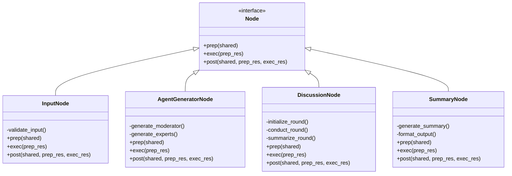
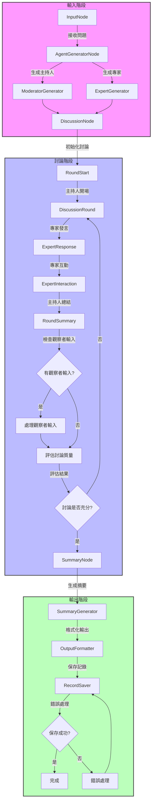
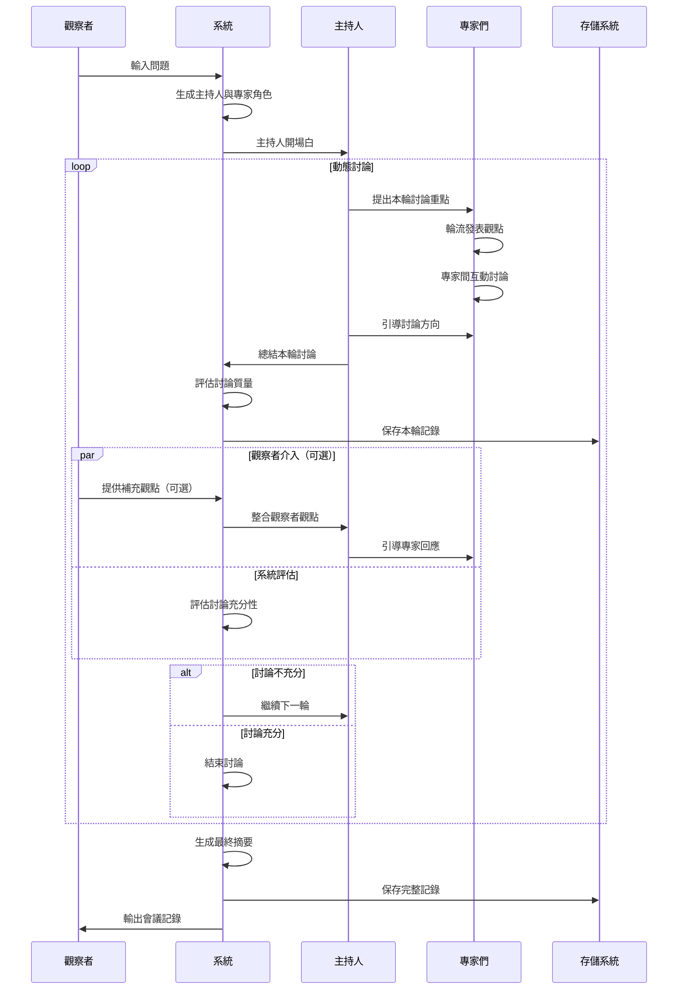

# AI 圓桌會議系統設計

## 系統概述
AI 圓桌會議系統是一個能夠根據使用者輸入的問題，動態生成多位代理人角色進行多輪討論，並自動產出最終摘要的系統。系統將模擬真實的圓桌會議，讓不同背景和專業領域的 AI 代理人進行深入討論。

## 核心功能
1. 動態生成代理人角色
2. 多輪討論機制
3. 觀點整合與摘要生成
4. 多方觀點呈現
5. 會議記錄管理
6. 進度追蹤與狀態管理
7. 錯誤處理與恢復機制

## 系統架構

### 1. 核心節點設計


### 2. 數據流設計


### 3. 會議流程設計


### 4. 共享數據結構
```python
shared = {
    "question": str,          # 使用者輸入的問題
    "moderator": Dict,        # 主持人信息
    "agents": List[Dict],     # 專家角色列表
    "discussion_history": List[Dict],  # 討論歷史
    "observer_inputs": List[Dict],     # 觀察者輸入記錄
    "summary": str,          # 最終摘要
    "timestamp": str,        # 會議時間戳
    "status": Dict,          # 系統狀態
    "error": Optional[Dict], # 錯誤信息
    "progress": Dict         # 進度信息
}
```

### 5. 代理人角色設計
每個代理人包含：
- 角色名稱
- 專業領域
- 性格特徵
- 觀點立場
- 專業背景描述
- 發言風格
- 互動偏好

## 實現細節

### 1. 代理人生成策略
- 根據問題關鍵字分析所需專業領域
- 確保代理人背景多樣性
- 動態調整代理人數量
- 生成合適的主持人角色
- 角色特徵平衡性檢查
- 避免角色重複或衝突

### 2. 討論機制
- 輪流發言制
- 觀點衝突處理
- 討論深度控制
- 動態評估討論充分性：
  - 觀點覆蓋度評估
  - 討論深度評估
  - 共識達成度評估
  - 分歧點明確性評估
  - 專家參與度評估
- 主持人引導和總結
- 專家互動質量評估
- 討論進度監控
- 動態調整討論策略
- 觀察者介入機制：
  - 完全可選的介入方式
  - 即時接收觀察者輸入（如有）
  - 智能整合觀察者觀點
  - 自然引導專家回應
  - 保持討論流程的連貫性
  - 不影響原有討論節奏

### 3. 摘要生成策略
- 提取關鍵觀點
- 整合不同立場
- 形成共識結論
- 保留重要分歧
- 提供後續建議
- 觀點重要性評估
- 結論可信度分析
- 討論充分性說明

### 4. 記錄管理
- 按時間戳保存記錄
- 結構化 YAML 格式
- 分類存儲討論記錄
- 支持歷史記錄查詢
- 記錄完整性驗證
- 自動備份機制
- 記錄版本控制

### 5. 錯誤處理機制
- 輸入驗證
- API 調用重試
- 異常狀態恢復
- 錯誤日誌記錄
- 用戶友好提示
- 系統狀態監控
- 自動恢復策略

## 技術實現
- 使用 Pocket Flow 框架
- OpenRouter API 進行 LLM 調用
  - 支援多個 AI 模型：
    - deepseek/deepseek-r1
    - openai/chatgpt-4o-latest
    - anthropic/claude-3.7-sonnet
  - 模型分配策略：
    - 輪詢方式平均分配請求
    - 自動負載均衡
    - 模型可用性監控
- YAML 格式處理結構化數據
- 異步處理多輪討論
- 進度顯示和錯誤處理
- 日誌記錄系統
- 性能監控
- 單元測試覆蓋
- 集成測試
- 部署文檔

## 環境配置
1. 安裝依賴：
```bash
pip install -r requirements.txt
```

2. 設置環境變量：
```bash
export OPENROUTER_API_KEY="your-api-key"
```

3. 運行系統：
```bash
python main.py
```

## 注意事項
1. API 使用限制：
   - 需要有效的 OpenRouter API 密鑰
   - 注意 API 調用頻率限制
   - 監控 API 使用成本

2. 模型特性：
   - 不同模型可能有不同的響應時間
   - 模型輸出格式可能略有差異
   - 需要適當的錯誤處理機制

3. 性能優化：
   - 異步處理 API 請求
   - 緩存常用響應
   - 監控系統資源使用
